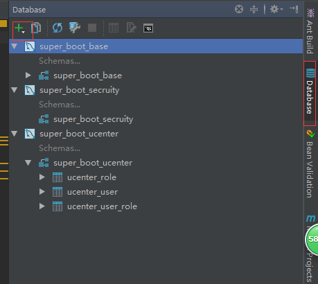
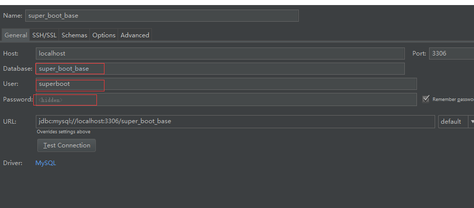
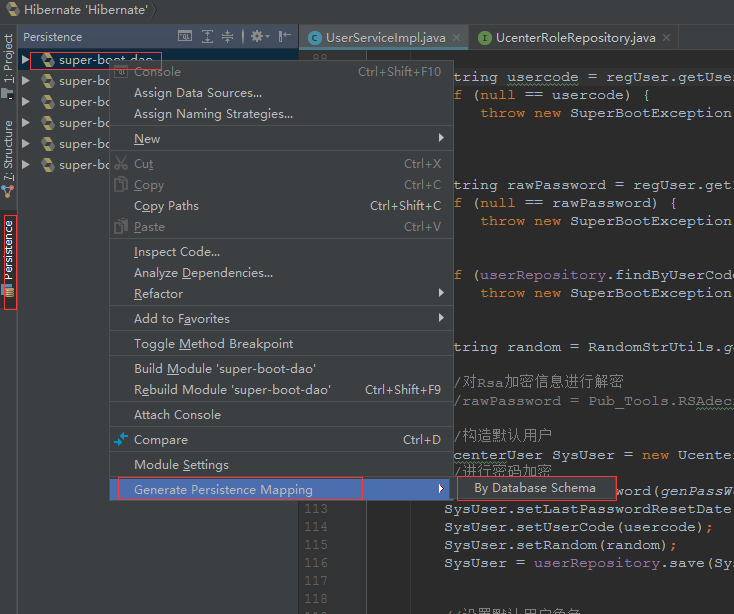
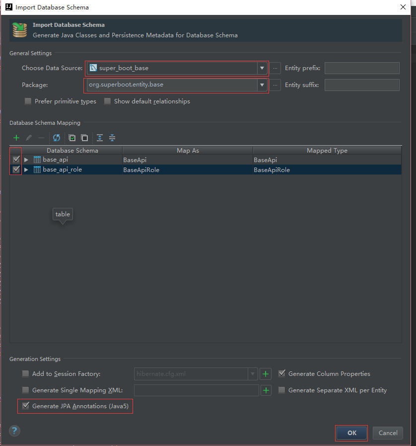
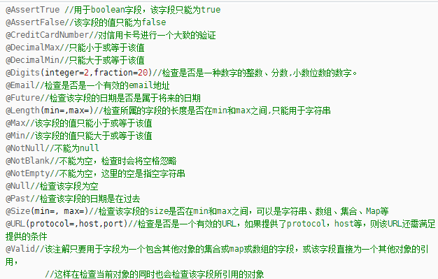

# 项目介绍
[](LICENSE)
[](https://github.com/7040210/SuperBoot)
[](https://github.com/7040210/SuperBoot)

　　SuperBoot框架是基于SpringCloud、SpringBoot、Vue的敏捷开发框架，框架开发初衷是为了方便快速开发项目，无需关心基础代码的编写，可以更专注于业务本身。框架实现基于JWT Token授权验证，实现单点登录SSO，服务鉴权，实现Redis数据缓存，在保证数据一致性的前提下提高接口响应速度。无缝集成MongoDB数据库，提供对非结构型数据存储，解决关系型数据库瓶颈问题。集成swagger框架，实现自动API测试及调试功能，解决程序员最反感的编写技术文档的问题。数据源基于Druid，提供更高性能及SQL监控。框架提供统一异常处理，统一响应结果，增加对JPA、Mongo的AOP拦截，由Snowflake ID自动生成赋值主键，数据实体无需开发均可由Idea自动生成。增删改查默认基于方法名称即可实现，无需写具体SQL。
  
## 组织结构
``` lua
super-boot
├── client-config  -- 项目配置文件信息，业务模块通过配置中心读取自动配置服务
├── project_info  --  项目相关信息包含数据字典、SQL语句、工具等
├── super-boot-utils    --  项目公用工具模块
├── super-boot-aop      --  项目公用业务拦截模块
├── super-boot-base     --  项目公用常量模块
├── super-boot-entity   --  项目公用实体模块
├── super-boot-global   --  项目公用全局模块
├── super-boot-common   --  项目公共模块
├── super-boot-dao      --  公共数据库操作模块
├── super-boot-config-center   --  配置中心
├── super-boot-gateway-center  --  网关中心
├── super-boot-logger-center   --  日志中心
├── super-boot-operation-center -- 监控中心 
├── super-boot-registry-center --  注册中心  
├── super-boot-secruity-center --  鉴权中心
├── super-boot-user-center     --  用户中心  
 

  


```

## 项目启动顺序
  1、启动注册中心（super-boot-registry-center）
<br>  2、启动配置中心（super-boot-config-center）
<br>  3、启动网关中心（super-boot-gateway-center）
<br>  4、启动业务模块（无先后顺序）
<br>  5、如果需要看服务运行监控则启用监控中心（super-boot-operation-center）

## 模块介绍

> super-boot-utils

此模块项目共用工具类及通用方法常量等信息，项目打包的时候会打包为jar包放入项目lib中。

> super-boot-aop

此模块为业务模块公用拦截器，比如日志拦截等，项目打包的时候会打包为jar包放入项目lib中。


> super-boot-base

此模块项目公用常量信息，项目打包的时候会打包为jar包放入项目lib中。


> super-boot-entity

此模块项目共用实体类，项目打包的时候会打包为jar包放入项目lib中。


> super-boot-global

此模块项目共用全局拦截器，项目打包的时候会打包为jar包放入项目lib中。


> super-boot-common

此模块项目共用工具类及通用方法常量等信息，项目打包的时候会打包为jar包放入项目lib中。

> super-boot-dao

此模块项目公共数据库操作模块，此模块主要配置操作super_boot_base数据库的相关接口方法，此模块定义为各模块均会用到的表，比如api定义的表及api接口授权角色表。项目打包的时候会打包为jar包放入项目lib中。

> super-boot-config-center

此模块为配置中心，在分布式环境中需要配置为高可用集群模式，增加安全及稳定性。
<br>启动后可以访问 http://localhost:9080/config-info.yml 

> super-boot-gateway-center

此模块为API网关中心，提供统一的API调用接口及相关配置功能。
<br>启动后可以访问 http://localhost:80

> super-boot-logger-center

此模块为日志可视化管理模块，提供项目操作日志的追踪分析及查看功能。


> super-boot-operation-center

此模块为监控中心，主要用于监控各服务模块运行状况。
<br>启动后可以访问 http://localhost:8080/hystrix

> super-boot-registry-center

此模块为注册中心，提供所以服务模块的注册、容错、负载均衡等功能。分布式环境中需要配置为高可用集群模式，要保证注册中心的稳定。
<br>启动后可以访问 http://localhost:1111

> super-boot-secruity-center

此模块为鉴权中心，主要提供TOKEN的生成、刷新、校验等功能。
<br>启动后可以访问 http://localhost:3333/swagger-ui.html

> super-boot-user-center

此模块为用户中心，提供用户注册、密码修改等相关功能。
<br>启动后可以访问 http://localhost:2222/swagger-ui.html


## Idea逆向生成数据库实体类
### 第一步配置 数据库

### 第二步配置 数据库连接信

### 第三步  配置hibernate，如果没有cfg.xml文件，点击ok后会自动生成

### 第四步 选择hibernate配置文件生成实体

### 第五步 设置完点击，选中要生成的实体的表



## 项目API接口自动添加到数据库示例代码

### 生成效果图


### 使用方式为在启动类添加如下代码即可
~~~~java

	
    @Autowired
    private Pub_DBUtils pub_DBUtils;


    /**
     * 扫描URL，如果数据库中不存在，则保存入数据库
     */
    @PostConstruct  //这个注解很重要，可以在每次启动的时候检查是否有URL更新，RequestMappingHandlerMapping只能在controller层用。这里我们放在主类中
    public void detectHandlerMethods(){
        final RequestMappingHandlerMapping requestMappingHandlerMapping = requestMappingHandlerConfig.requestMappingHandlerMapping ();
        pub_DBUtils.addApiToDB(requestMappingHandlerMapping);
    }

~~~~

## 项目启用校验国际化功能

### 1、RESTful增加 @Validated 注解
 
### 2、实体类增加需要校验的注解类型即可
 
#### 主要用到的注解类型
 
 


##  Spring Data JPA 为此提供了一些表达条件查询的关键字，大致如下：

#### And --- 等价于 SQL 中的 and 关键字，比如 findByUsernameAndPassword(String user, Striang pwd)

#### Or --- 等价于 SQL 中的 or 关键字，比如 findByUsernameOrAddress(String user, String addr)

#### Between --- 等价于 SQL 中的 between 关键字，比如 findBySalaryBetween(int max, int min)

#### LessThan --- 等价于 SQL 中的 "<"，比如 findBySalaryLessThan(int max)

#### GreaterThan --- 等价于 SQL 中的">"，比如 findBySalaryGreaterThan(int min)

#### IsNull --- 等价于 SQL 中的 "is null"，比如 findByUsernameIsNull()

#### IsNotNull --- 等价于 SQL 中的 "is not null"，比如 findByUsernameIsNotNull()

#### NotNull --- 与 IsNotNull 等价

#### Like --- 等价于 SQL 中的 "like"，比如 findByUsernameLike(String user)

#### NotLike --- 等价于 SQL 中的 "not like"，比如 findByUsernameNotLike(String user)

#### OrderBy ---等价于 SQL 中的 "order by"，比如 findByUsernameOrderBySalaryAsc(String user)

#### Not --- 等价于 SQL 中的 "！ ="，比如 findByUsernameNot(String user)

#### In --- 等价于 SQL 中的 "in"，比如 findByUsernameIn(Collection<String> userList) ，方法的参数可以是 Collection 类型，也可以是数组或者不定长参数

#### NotIn --- 等价于 SQL 中的 "not in"，比如 findByUsernameNotIn(Collection<String> userList) ，方法的参数可以是 Collection 类型，也可以是数组或者不定长参数